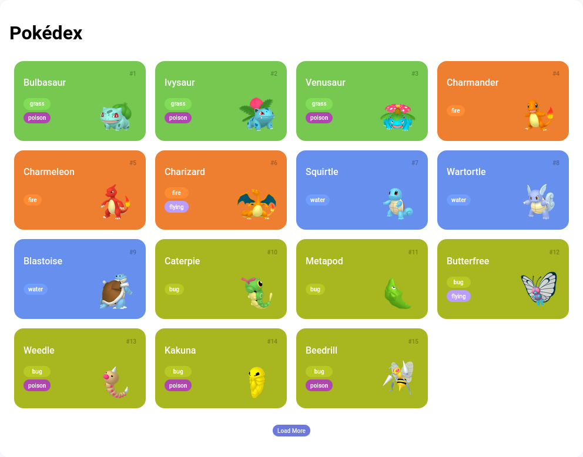

<h1 align="center">Basic-Pokedex</h1>

## 📲 View the project here
<a href="https://c-alvinn.github.io/Basic-Pokedex/">https://c-alvinn.github.io/Basic-Pokedex/</a>

## 📖 About the project
This project is a simple Pokédex made with JavaScript, HTML and CSS.



## 🦾 Technologies used
<div style="display: flex;">
 


</div>

## 👽 How to clone this project

````bash
    # Select where you want to clone
    $ cd ~/Documents/WHERE_YOU_WANT
````

````bash
    # Clone the project
    $ git clone https://github.com/c-Alvinn/Basic-Pokedex.git
````

````bash
    # Check if cloning worked fine
    $ cd ~/Documents/DIRECTORY_LOCATION
    $ ls
````
